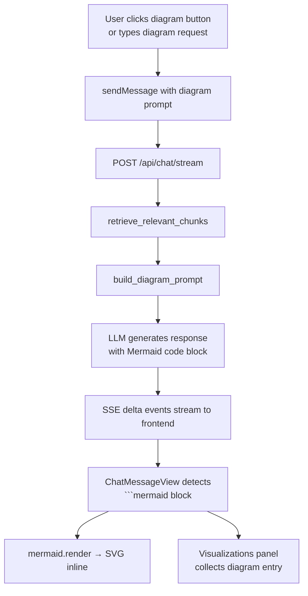

# Design Document: Dynamic Visual Explanations

## Overview

This feature extends NeuroDocs AI with the ability to generate and display Mermaid diagrams — flowcharts, timelines, architecture diagrams, and concept maps — both on explicit user request and proactively when the AI determines a visual would aid understanding.

The implementation is deliberately minimal: the existing Mermaid.js integration already renders ` ```mermaid ` code blocks in chat messages. The backend change is a prompt-engineering addition to `llm.py` that instructs the LLM to emit Mermaid syntax when appropriate. The frontend changes are: (1) four diagram-type buttons in the composer, (2) improved inline rendering in `ChatMessageView`, and (3) a populated Visualizations tab in the right panel.

No new API endpoints are needed. Diagrams flow through the existing SSE stream as part of the normal `delta` events.

---

## Architecture



Key design decisions:
- Diagrams are delivered through the existing SSE stream — no new endpoint, no polling.
- Diagram intent detection (explicit vs. auto) happens entirely in the backend prompt layer.
- The frontend stores rendered diagrams in React state (`visualizations` array) scoped to the session.
- The Visualizations panel reads from that state; no separate persistence is needed for MVP.

---

## Components and Interfaces

### Backend: `app/services/llm.py`

Two additions:

**`detect_diagram_intent(message: str) -> DiagramIntent | None`**
Parses the user message for explicit diagram keywords. Returns a `DiagramIntent` with `diagram_type` and `explicit: True`, or `None` if no explicit request is found.

```python
@dataclass
class DiagramIntent:
    diagram_type: str   # "flowchart" | "timeline" | "architecture" | "concept_map"
    explicit: bool      # True = user asked, False = auto-detected
```

**`build_diagram_system_prompt(intent: DiagramIntent | None) -> str`**
Returns the system prompt string. When `intent` is not `None`, it appends diagram-specific instructions to `SYSTEM_PROMPT`. When `intent` is `None`, the base prompt is returned unchanged (auto-detection is handled by a standing instruction in the base prompt).

The updated `SYSTEM_PROMPT` gains a standing auto-detection clause:

```
When your response describes a process, sequence, hierarchy, or system with
three or more distinct components, append a Mermaid code block labelled
"Visual summary:" using the most appropriate diagram type. Do not add a
diagram if the user has already requested one explicitly.
```

Explicit diagram instructions (appended when `intent.explicit is True`):

```
The user has requested a {diagram_type} diagram. Produce ONLY a Mermaid
code block of type {mermaid_keyword} grounded in the retrieved context.
Precede the block with one sentence describing what it shows.
Supported types and their Mermaid keywords:
  flowchart   → flowchart TD
  timeline    → timeline
  architecture → graph LR
  concept_map → mindmap
```

**`stream()` / `complete()` changes**
Both methods call `detect_diagram_intent(message)` and pass the result to `build_diagram_system_prompt`. The resulting prompt replaces the static `SYSTEM_PROMPT` for that call only.

### Frontend: `frontend/src/main.jsx`

#### `DiagramButtons` component (new)

```jsx
<DiagramButtons onRequest={sendMessage} disabled={isStreaming} />
```

Renders four buttons: Flowchart, Timeline, Architecture, Concept Map. Each calls `sendMessage` with a canned prompt like:
`"Generate a flowchart diagram from the document context."`

#### `ChatMessageView` — updated Mermaid rendering

Current behaviour: renders the first ` ```mermaid ` block as SVG and hides the rest of the message.

Updated behaviour:
- Render prose sections and Mermaid blocks in order (split on ` ```mermaid...``` ` boundaries).
- On render failure, show the raw source in a `<pre>` with an error notice.
- After successful render, call `onDiagramRendered({ svg, diagramType, messageId, timestamp })` callback.
- Add `aria-label` to the rendered SVG wrapper.

#### `VisualizationsPanel` component (new)

```jsx
<VisualizationsPanel diagrams={visualizations} />
```

`visualizations` is a state array in `App`:
```js
const [visualizations, setVisualizations] = useState([]);
```

Each entry:
```js
{ id, svg, diagramType, messageId, timestamp }
```

`VisualizationsPanel` renders:
- Empty state: "Diagrams generated during this session will appear here."
- Populated: list of entries in reverse-chronological order, each showing type label + timestamp + SVG thumbnail.
- Clicking an entry opens a modal/expanded view with the full SVG and a close button that traps focus.

#### Right panel tab routing

The existing `rightTab` state already controls which panel body is shown. The `"Visualizations"` tab case is updated to render `<VisualizationsPanel>` instead of the current empty placeholder.

---

## Data Models

### `DiagramIntent` (Python dataclass, backend)

| Field | Type | Description |
|---|---|---|
| `diagram_type` | `str` | One of `flowchart`, `timeline`, `architecture`, `concept_map` |
| `explicit` | `bool` | `True` if user explicitly requested; `False` if auto-detected |

### `DiagramEntry` (frontend, in-memory React state)

| Field | Type | Description |
|---|---|---|
| `id` | `string` | UUID, generated at render time |
| `svg` | `string` | Raw SVG markup from `mermaid.render()` |
| `diagramType` | `string` | One of the four supported types |
| `messageId` | `string` | ID of the chat message that produced this diagram |
| `timestamp` | `string` | ISO 8601 timestamp |

### Keyword mapping (backend constant)

```python
DIAGRAM_KEYWORDS: dict[str, list[str]] = {
    "flowchart":     ["flowchart", "flow chart", "flow diagram", "process diagram"],
    "timeline":      ["timeline", "time line", "chronological", "sequence of events"],
    "architecture":  ["architecture", "system diagram", "component diagram", "infrastructure"],
    "concept_map":   ["concept map", "mind map", "mindmap", "knowledge map", "concept diagram"],
}

MERMAID_KEYWORD: dict[str, str] = {
    "flowchart":    "flowchart TD",
    "timeline":     "timeline",
    "architecture": "graph LR",
    "concept_map":  "mindmap",
}
```

---

## Correctness Properties

*A property is a characteristic or behavior that should hold true across all valid executions of a system — essentially, a formal statement about what the system should do. Properties serve as the bridge between human-readable specifications and machine-verifiable correctness guarantees.*

Property 1: Explicit keyword detection is exhaustive
*For any* user message string that contains at least one keyword from `DIAGRAM_KEYWORDS[t]` for some diagram type `t`, `detect_diagram_intent` SHALL return a `DiagramIntent` with `diagram_type == t` and `explicit == True`.
**Validates: Requirements 2.1**

Property 2: No false positives in keyword detection
*For any* user message string that contains no keyword from any entry in `DIAGRAM_KEYWORDS`, `detect_diagram_intent` SHALL return `None`.
**Validates: Requirements 2.1, 3.1**

Property 3: Mermaid keyword mapping is total
*For any* `diagram_type` value in `{"flowchart", "timeline", "architecture", "concept_map"}`, `MERMAID_KEYWORD[diagram_type]` SHALL return a non-empty string that begins with a valid Mermaid diagram declaration keyword.
**Validates: Requirements 6.1, 6.2, 6.3, 6.4**

Property 4: Diagram entry completeness round-trip
*For any* `DiagramEntry` object stored in the `visualizations` array, reading it back SHALL produce an object with identical `id`, `diagramType`, `messageId`, `timestamp`, and non-empty `svg` fields.
**Validates: Requirements 5.1, 5.5**

Property 5: Visualizations panel reverse-chronological ordering
*For any* non-empty sequence of `DiagramEntry` objects with distinct timestamps, `VisualizationsPanel` SHALL render them such that each entry appears before all entries with an earlier timestamp.
**Validates: Requirements 5.4**

Property 6: Fallback stream always yields a Mermaid block
*For any* diagram type string in the supported set, when `OpenAIChatService.client is None`, calling `stream()` SHALL yield at least one chunk of text containing a ` ```mermaid ` code block.
**Validates: Requirements 7.3**

Property 7: Prompt exclusivity — no double diagram instructions
*For any* message where `detect_diagram_intent` returns a non-`None` intent, `build_diagram_system_prompt` SHALL return a string that contains the explicit diagram instruction and does NOT contain the auto-detection standing clause.
**Validates: Requirements 3.4, 7.4**

Property 8: Prompt contains correct Mermaid keyword for explicit intent
*For any* `DiagramIntent` with a valid `diagram_type`, `build_diagram_system_prompt` SHALL return a string containing the corresponding `MERMAID_KEYWORD` value for that type.
**Validates: Requirements 7.1**

Property 9: Rendered diagram wrapper has aria-label
*For any* successfully rendered Mermaid diagram, the wrapper element in `ChatMessageView` SHALL have a non-empty `aria-label` attribute that includes the diagram type.
**Validates: Requirements 8.1**

Property 10: Mixed-content messages render both prose and diagram
*For any* assistant message string containing both prose text and a ` ```mermaid ` code block, `ChatMessageView` SHALL render a non-empty prose section and a non-empty SVG section in the output.
**Validates: Requirements 4.3**

Property 11: Diagram button click sends correct diagram type keyword
*For any* diagram type button in `DiagramButtons`, clicking it SHALL invoke `sendMessage` with a string that contains the corresponding diagram type name (e.g., "flowchart", "timeline", "architecture", "concept map").
**Validates: Requirements 1.2**

---

## Error Handling

| Scenario | Handling |
|---|---|
| Mermaid render fails (invalid syntax from LLM) | `ChatMessageView` catches the rejected promise; displays raw source in `<pre>` with "Diagram could not be rendered" notice. |
| LLM returns no Mermaid block despite diagram request | Frontend renders the prose response normally; no diagram entry is added to `visualizations`. |
| LLM in fallback mode (no API key) | `stream()` yields a static placeholder Mermaid block with a note. |
| User clicks diagram button while streaming | Buttons are `disabled` during streaming; click events are ignored. |
| Visualizations panel expanded view | Focus is trapped inside the modal; `Escape` key closes it. |

---

## Testing Strategy

### Unit tests (specific examples and edge cases)

- `detect_diagram_intent`: test each keyword variant, mixed-case inputs, messages with no keywords, messages with multiple keyword types (first match wins).
- `build_diagram_system_prompt`: verify explicit instructions are present when `intent` is provided; verify auto-detection clause is present in base prompt; verify both are not present simultaneously.
- `MERMAID_KEYWORD` mapping: verify all four types map to valid Mermaid declaration strings.
- `VisualizationsPanel`: render with empty list → shows placeholder; render with entries → shows entries in reverse order.
- `ChatMessageView`: render with valid Mermaid block → SVG present; render with invalid block → error notice present; render with prose + Mermaid → both sections present.

### Property-based tests

Use [Hypothesis](https://hypothesis.readthedocs.io/) for Python backend tests and [fast-check](https://fast-check.io/) for frontend tests.

Each property test runs a minimum of 100 iterations.

- **Property 1** — `detect_diagram_intent` keyword detection (Hypothesis, `st.sampled_from` over keyword lists)
  Tag: `Feature: dynamic-visual-explanations, Property 1: explicit keyword detection is exhaustive`

- **Property 2** — `detect_diagram_intent` no false positives (Hypothesis, `st.text()` filtered to exclude all keywords)
  Tag: `Feature: dynamic-visual-explanations, Property 2: no false positives in keyword detection`

- **Property 3** — `MERMAID_KEYWORD` mapping totality (Hypothesis, `st.sampled_from` over the four type strings)
  Tag: `Feature: dynamic-visual-explanations, Property 3: mermaid keyword mapping is total`

- **Property 4** — `DiagramEntry` round-trip (fast-check, arbitrary `DiagramEntry` objects)
  Tag: `Feature: dynamic-visual-explanations, Property 4: diagram entry round-trip`

- **Property 5** — Visualizations panel ordering (fast-check, arbitrary arrays of `DiagramEntry`)
  Tag: `Feature: dynamic-visual-explanations, Property 5: visualizations panel ordering`

- **Property 6** — Fallback diagram presence (Hypothesis, arbitrary diagram type strings)
  Tag: `Feature: dynamic-visual-explanations, Property 6: fallback diagram on missing API key`

- **Property 7** — No double diagram prompt (Hypothesis, arbitrary messages with explicit intent)
  Tag: `Feature: dynamic-visual-explanations, Property 7: no double diagram on explicit request`
